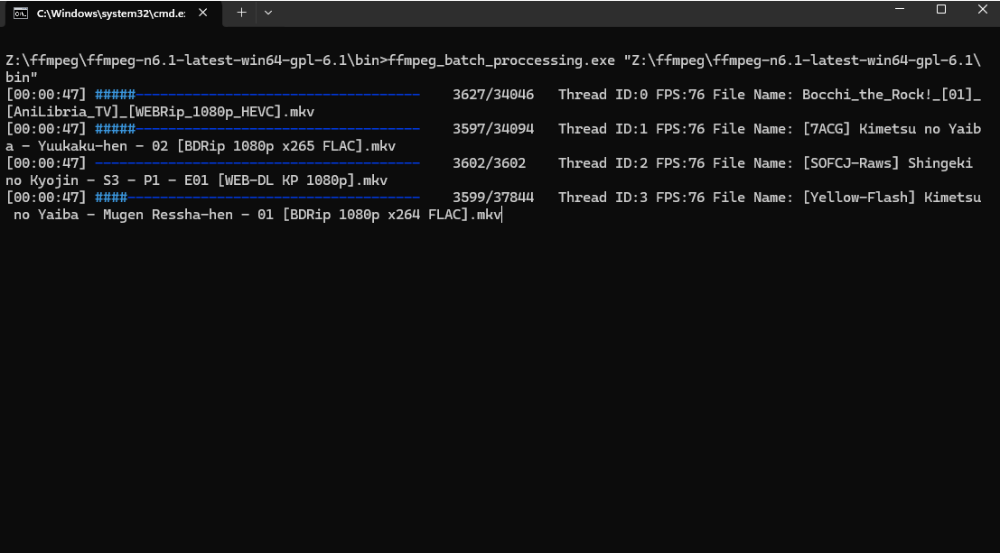

# FFmpeg batch proccessing

  </img>

# What is this?
This is a utility for conveniently processing multiple videos using ffmpeg.

# How to use?
1. The first time you run the program, it will create a config.json file.
2. Edit config.json, set path to ffmpeg executable.
3. Launch the program specifying the path to a folder with several videos.
Example:
``
ffmpeg_batch_proccessing.exe "path to folder with videos"
``
4. The processed videos will be located in the finish folder.